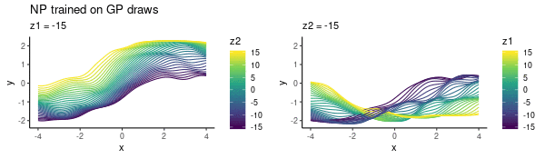

# Neural Processes



This is an implementation of Neural Processes for 1D-regression, accompanying [my blog post](https://kasparmartens.rbind.io/post/np/). 

### Structure of the repo

The implementation uses TensorFlow in R:

* The files [NP_architecture*.R](https://github.com/kasparmartens/NeuralProcesses/blob/master/NP_architecture1.R) specify the NN architectures for the encoder *h* and decoder *g* as well as the aggregator and the mapping from *r* to *z*. 
* The file [NP_core.R](https://github.com/kasparmartens/NeuralProcesses/blob/master/NP_core.R) contains functions to define the loss function and carry out posterior prediction. 

Note: when changing network architecture, e.g. when fitting a new model, you need to run `tf$reset_default_graph()` or restart your R session.

All experiments can be found in the "experiments" folder (where they appear in the same order as in the blog post): 

* The [first experiment](https://github.com/kasparmartens/NeuralProcesses/blob/master/experiments/1_experiment.R) involves training an NP on a single small data set. 
* The [second experiment](https://github.com/kasparmartens/NeuralProcesses/blob/master/experiments/2_experiment.R) involves training an NP on a small class of functions of the form `a * sin(x)`.
* The [third experiment](https://github.com/kasparmartens/NeuralProcesses/blob/master/experiments/3_experiment.R) involves training an NP on repeated draws from the GP.

### Example code

Loading all the libraries and helper functions

```R
library(tidyverse)
library(tensorflow)
library(patchwork)

source("NP_architecture1.R")
source("NP_core.R")
source("GP_helpers.R")
source("helpers_for_plotting.R")
```

Setting up the NP model: 

```R
sess <- tf$Session()

# specify (global variables) for dimensionality of r, z, and hidden layers of g and h
dim_r <- 2L
dim_z <- 2L
dim_h_hidden <- 32L
dim_g_hidden <- 32L

# placeholders for training inputs
x_context <- tf$placeholder(tf$float32, shape(NULL, 1))
y_context <- tf$placeholder(tf$float32, shape(NULL, 1))
x_target <- tf$placeholder(tf$float32, shape(NULL, 1))
y_target <- tf$placeholder(tf$float32, shape(NULL, 1))

# set up NN
train_op_and_loss <- init_NP(x_context, y_context, x_target, y_target, learning_rate = 0.001)

# initialise
init <- tf$global_variables_initializer()
sess$run(init)
```

Now, sampling data according to the function y = a*sin(x),we can fit the model as follows:

```R
n_iter <- 10000

for(iter in 1:n_iter){
  # sample data (x_obs, y_obs)
  N <- 20
  x_obs <- runif(N, -3, 3)
  a <- runif(1, -2, 2)
  y_obs <- a * sin(x_obs)
  
  # sample N_context for training
  N_context <- sample(1:10, 1)
  
  # use helper function to pick a random context set
  feed_dict <- helper_context_and_target(x_obs, y_obs, N_context, x_context, y_context, x_target, y_target)
  
  # optimisation step
  a <- sess$run(train_op_and_loss, feed_dict = feed_dict)
  
  if(iter %% 1e3 == 0){
    cat(sprintf("loss = %1.3f\n", a[[2]]))
  }
}
```

Prediction using the trained model:

```R
# context set at prediction-time
x0 <- c(0, 1)
y0 <- 1*sin(x0)

# prediction grid
x_star <- seq(-4, 4, length=100)

# plot posterior draws
plot_posterior_draws(x0, y0, x_star, n_draws = 50)

```

### Other resources

*Update (February 2019)*: The authors of the Neural Process papers have now made their implementation available here [https://github.com/deepmind/neural-processes](https://github.com/deepmind/neural-processes)
